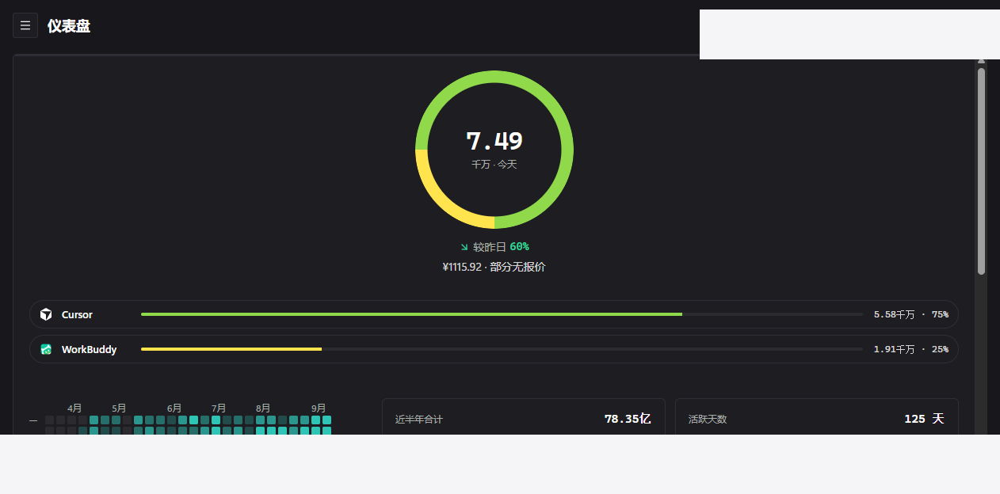

# AgentHub

本机桌面控制台：把 Cursor / Codex / Trae / WorkBuddy 等 Agent 的**用量、会话、Skill、MCP、共用规则**收拢到一个窗口里管理。

> Windows 桌面应用（WPF + 同进程 Kestrel + Vue 3）。Mac 为 Tauri 薄壳 + 无界面 Backend。默认只监听 `127.0.0.1`，写操作需要本机令牌，不对外网暴露。



## 能做什么

| 模块 | 作用 |
|---|---|
| **仪表盘** | 汇总各家 Token / 额度卡片，支持费用估算与币种切换 |
| **会话** | 浏览、预览、清理本机会话；支持批量删除 |
| **能力** | 管理 `~/.agents/skills`（启用/停用、安装更新、删除）以及各家 MCP |
| **资料** | 浏览外置方案库（默认不落业务仓） |
| **规则** | 编辑并同步各家 Agent 的共用规则母本 |
| **Codex** | 管理 Codex 连接与 ChatGPT 账号档案 |

## 技术栈

- **Windows 壳**：.NET 10 WinExe / WPF + WebView2 + 托盘
- **Mac 壳**：Tauri 2，子进程拉起 Backend
- **后端**：Kestrel（`127.0.0.1:18780`），业务在 `AgentHub.Runtime`
- **前端**：Vue 3 + Vite + Naive UI（Hash 路由，产物在 `wwwroot/app/`）
- **数据**：配置 %APPDATA%\AgentHub，本机缓存 %LOCALAPPDATA%\AgentHub.Local；密钥走 DPAPI

## 快速开始

### 环境

- Windows 10/11 x64（Mac 壳另需 .NET 10 与 Rust/Tauri 工具链）
- [.NET 10 SDK](https://dotnet.microsoft.com/download)
- Node.js 20+（仅构建前端需要）

### 开发构建

仓库根目录：

```powershell
.\rebuild.ps1
```

脚本会：结束旧进程 → 强制构建前端 → `dotnet publish` Release + ReadyToRun → 启动应用。

输出目录固定为：

`src/AgentHub/bin/Debug/net10.0-windows10.0.19041.0`

（开机自启注册表指向这里，不要改输出路径。）

只改前端也可：

```powershell
cd src\AgentHub\frontend
npm install
npm run build
```

无界面后端（须先退出桌面壳，端口互斥）：

```powershell
dotnet run --project src/AgentHub.Backend
```

### 发版

Windows 见 `pack/windows/pack.ps1` 与 tag `v*`。版本号需与 `src/Directory.Build.props` 的 Version、`latest.json` 一致。发版 workflow 会把 Velopack 产物同步到 Gitee Release（应用内更新源）；仓库 Settings → Secrets 需配置 `GITEE_TOKEN`（Gitee 私人令牌，projects 权限）。手动 Setup 安装包只发 GitHub。

Mac 打包脚本在 `pack/macos/`。

## 安全口径

- 读接口可本机访问；**写接口**必须带 `X-AgentHub-Token`，且 Host 为 `127.0.0.1`
- 不把 Cookie、API Key、用量库、本机绝对路径提交进 Git
- Skill 的「中文名 / 备注」只存在本机 `skills-state.json`，**不会**写回 `SKILL.md`，更新 Skill 也不会冲掉

## 目录速览

```text
src/
  AgentHub/            Windows 壳、frontend、wwwroot
    Shell/
    frontend/
    wwwroot/
  AgentHub.Runtime/    Core + Web + Hosting
  AgentHub.Backend/    无界面入口
  AgentHub.Mac/        Tauri 壳
media/readme/
```
